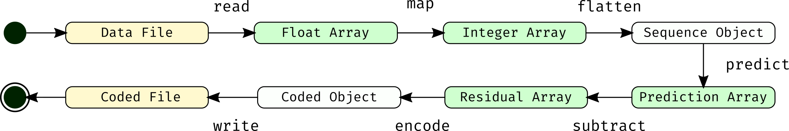

Code from publication [@ACM SIGSPATIAL 2018](https://doi.org/10.1145/3274895.3274897):
Modular Software Framework for Compression of Structured Environmental Data.

# cframework
This framework should help with the design and development of a prediction-based compression method for climate data.

## Requirements and installation
This code has been tested on following machine:

```
Python: 3.6.1
OS: Debian 4.11.6-1 (2017-06-19) testing (buster)
CPU: Intel(R) Core(TM) i5-7200U CPU @ 2.50GHz
MEM: 16 GiB 2400MHz DDR4
```

To recreate the software environment you can use the provided
`spec-file.txt` and `requirements.txt` files. Currently only GNU/Linux is supported.

```bash
conda create -n ENVNAME --file spec-file.txt
conda activate ENVNAME
pip install -r requirements.txt
```

> macOS & Windows: Conda does not support cross-platform export of package names including versions. As soon as this feature is added I'll generate the appropriate macOS and Windows environmental files.

## Inner workings

### A workflow
A workflow defines the whole compression process from start to finish. The following figure will give a short overview of the steps and modifiers as well as objects involved in the compression process.

<p align="center"></p>

A workflow is defined by its five modifiers: mapper, sequencer, predictor, subtractor and encoder. These modifiers define the whole compression process (`map`,`flatten`, `predict`, `subtract`, `encode`) depicted in the figure above. The `read` and `write` processes are provided by the Python standard library.

### A modifier
<p align="center"></p>

A modifier defines how to transform one object to the other. It provides one function (with appropriate inverse function for the decompression process) and operate on only on one object. The following table provides an overview of the interface for each of the modifiers.

| modifier  | function    | inverse function | input object                             | output object   |
|-----------|-------------|------------------|------------------------------------------|-----------------|
| mapper    | `map()`     | `rev_map()`      | floatarray                               | integerarray    |
| sequencer | `flatten()` | -                | integerarray                             | sequence object |
| predictor | `predict()` | -                | integerarray, startnode, sequence object | predictionarray |
| subtractor| `subtract()`| -                | integerarray, predictionarray            | residualarray   |
| encoder   | `encode()`  | `decode()`       | residualarray                            | coded object    |

_The input and output objects are switched if the appropriate inverse function is used._

### An object
<p align="center"></p>

An object defines the state of the data during the (de)compression process. The following UML-diagram provides information about each object and the attributes provided by it.

_The keen observer might have discovered that the integer, residual and predictionarrays provide the same attributes and have the same properties. But the separation is necessary due to the fact that the modifiers are only allowed to operate on one kind of object._

## Project structure
The `cframe` folder is structured as follows:

```
cframe/
├── backend
├── data
├── format
├── modifier
│   ├── encoder
│   ├── mapper
│   ├── predictor
│   ├── sequencer
│   └── subtractor
├── objects
│   └── arrays
└── toolbox
```

- `backend` Files which define the interfaces of the objects and modifiers. The modifier definitions use a `mod` suffix and the object definitions use the `obj` suffix.
- `data` Example netcdf file [[source](https//www.unidata.ucar.edu/software/netcdf/examples/files.html)]
- `format` Preliminary format definition including white paper
- `modifier` Actual instances for modifier objects (_following explanation is ordered by execution steps, not alphabetically_)
  - `mapper` Mapping of floating point values to integers
  - `sequencer` Traversal of the dataset with `startnode` and optional `order` parameter (*further sequencer are provided in following repository [informationspaces](https//github.com/ucyo/informationspaces.git)*)
  - `predictor` Prediction of the next value based on past experience
  - `subtractor` Modifier for calculation of the difference between prediction and true value
  - `encoder` Methods for writing of the data on disk (according to the definition in `format`)
- `objects` Implementation of the objects. The arrays are put in a separate subfolder for better organisation
- `toolbox` Additional helper functions to provide workflows, parallel execution, subsetting, and quality assessment
    - `feeder` Pre-allocation of arrays to help improve calculation speed during the prediction process. This prevents copying data over and over in memory
    - `parallel` Parallel execution of several `workflows`
    - `qualityassessment` Statistics about the compressed data
    - `subsetting` Random subsets of a dataset of size `N`
    - `workflow` Wrapper class for the definition of a complete (de)compression process
